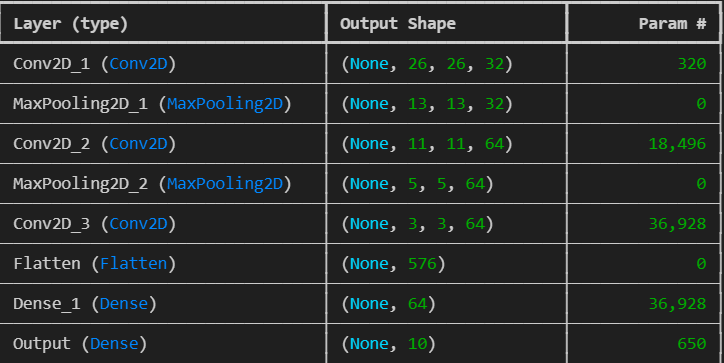
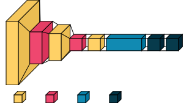
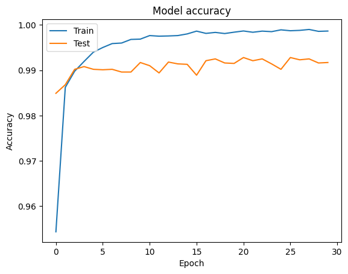
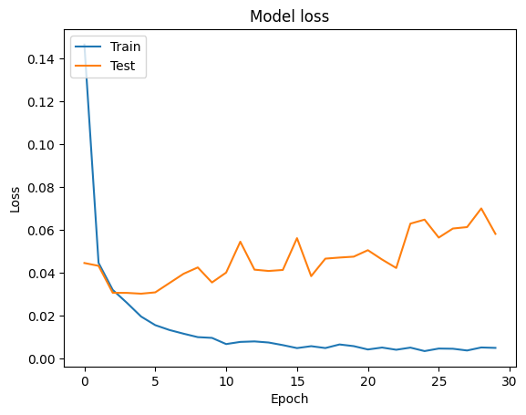
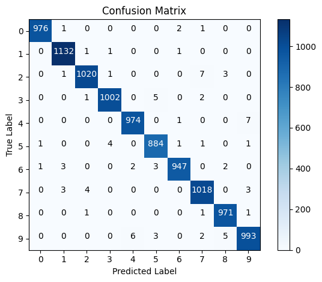
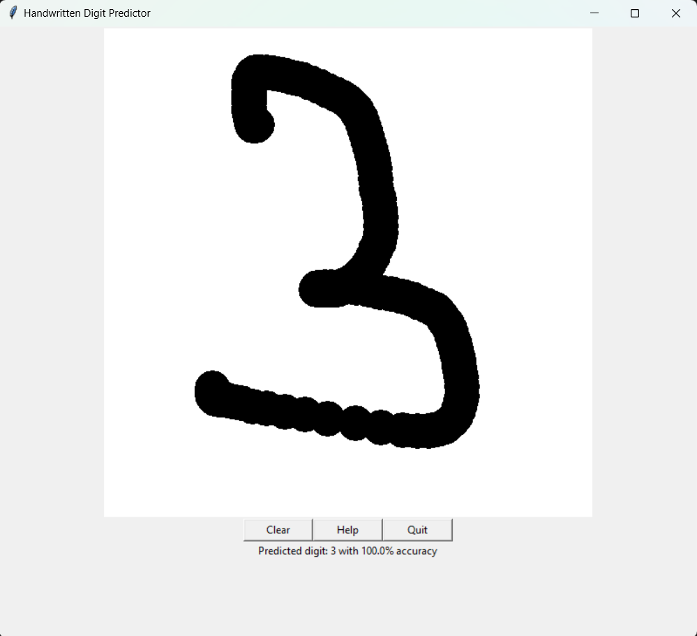

# Digit Recognition using CNN

This project is a simple implementation of a Convolutional Neural Network (CNN) trained on the MNIST dataset to recognize  digits. The GUI allows users to draw a digit, and the model predicts the digit along with the accuracy of the prediction.

## Table of Contents
- [Introduction](#introduction)
- [Dataset](#dataset)
- [Model Architecture](#model-architecture)
- [Training Details](#training-details)
- [Evaluation](#evaluation)
- [Usage](#usage)
- [Results](#results)
- [Screenshots](#screenshots)
- [How to Run](#how-to-run)
- [Requirements](#requirements)

## Introduction
This project uses a CNN model to classify digits. A graphical interface built with `tkinter` allows users to draw digits on a canvas, which are then passed to the trained model for prediction.

## Dataset
The model is trained on the [MNIST dataset](http://yann.lecun.com/exdb/mnist/), which contains 70,000 28x28 grayscale images of handwritten digits from 0 to 9.

## Model Architecture
The CNN model consists of the following layers:
- Conv2D (32 filters, 3x3 kernel, ReLU activation)
- MaxPooling2D (2x2 pool size)
- Conv2D (64 filters, 3x3 kernel, ReLU activation)
- MaxPooling2D (2x2 pool size)
- Conv2D (64 filters, 3x3 kernel, ReLU activation)
- Flatten
- Dense (64 units, ReLU activation)
- Dense (10 units, Softmax activation)

Here is the summary of the model:



### Model Architecture Visualization
The architecture of the CNN model is visualized as follows:



## Training Details
The model is trained for 30 epochs using the Adam optimizer and categorical cross-entropy loss. Below are the training and validation accuracy and loss:

- **Training and Validation Accuracy**:



- **Training and Validation Loss**:



## Evaluation
The model is evaluated using a test set. The following confusion matrix shows the performance of the model on the test data:



The metrics used for evaluation include:
- **Precision**
- **Recall**
- **F1-Score**

## Usage
Once trained, the model can be used in a graphical interface (GUI) to predict  digits. Simply draw a digit on the canvas, and the model will predict the digit and display the confidence of the prediction.

### GUI


## Results
The model achieves a high accuracy on the test set, with the predictions being visually displayed in the GUI.

## How to Run
1. Clone the repository:
   ```bash
   git clone https://github.com/your-username/digit-recognition.git

2. Install the required dependencies:
   ```bash
   pip install -r requirements.txt

3. Run the GUI: 
   ```bash 
   python gui.py
